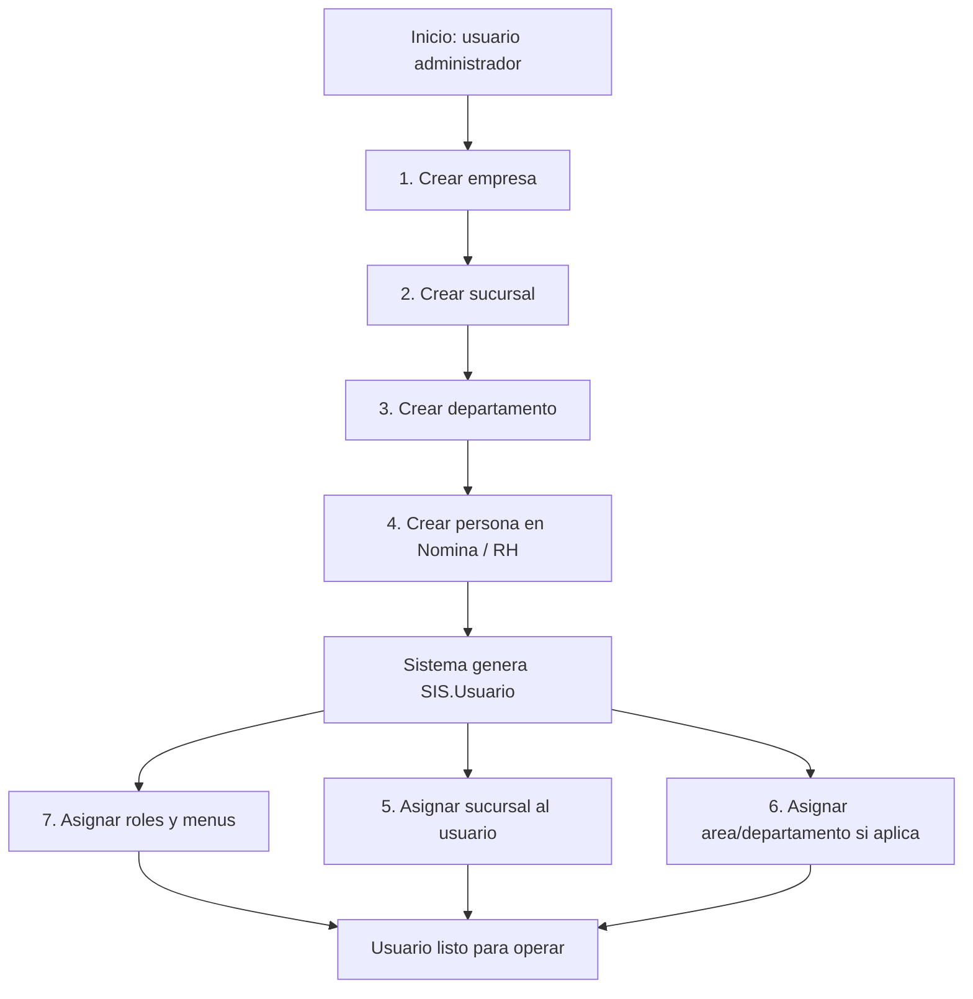
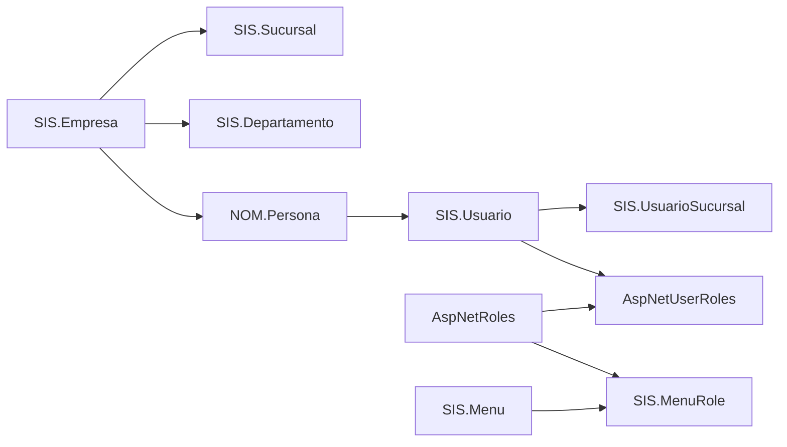

# Flujo inicial de configuracion

Esta guia documenta el arranque recomendado para dejar lista una empresa en EGestion360 y habilitar usuarios operativos con permisos.

## Diagrama general

## Dependencias

## Reglas del flujo

1. Empresa es el primer catalogo operativo. Debe existir antes de sucursales, departamentos y personas.
2. Sucursal depende de empresa y estado. El tipo de sucursal se resuelve con el primer tipo activo si la pantalla no lo captura.
3. Departamento depende de empresa. Puede usarse para estructura interna y para clasificacion de contratos/persona.
4. Persona de Nomina/RH es la fuente para crear empleados.
5. Al crear o actualizar una persona de Nomina/RH, el backend garantiza que exista un registro en `SIS.Usuario`.
6. El `SIS.Usuario` generado usa:
   - `FKIdPersona_NOM`: id de la persona creada.
   - `FKIdEmpresa_SIS`: empresa de la persona.
   - `AspNetUserId`: clave tecnica `NOM-PERSONA-{id}`.
   - `PayrollID`: numero de empleado, ajustado si ya existe.
7. Despues de generar usuario, se asignan sucursales y roles desde Configuracion > Sistema > Usuario y Configurar Accesos.
8. Los roles definen acceso a menus y acciones. Sin roles/menu claims, el usuario no debe operar pantallas.

## ABC esperado por pantalla

| Pantalla | Ruta | Alta | Edicion | Baja | Notas |
| --- | --- | --- | --- | --- | --- |
| Empresa | `/configuracion/sistema/empresa` | Si | Si | Si | Base del flujo. |
| Sucursal | `/configuracion/sistema/sucursal` | Si | Si | Si | No permite eliminar matriz desde backend. |
| Departamento | `/configuracion/sistema/departamento` | Si | Si | Si | Depende de empresa. |
| Persona RH | `/rh/persona` | Si | Si | Si | Genera/normaliza `SIS.Usuario`. |
| Usuario | `/configuracion/sistema/usuarios` | Si | Si | Si | Sirve para editar usuario y asignar sucursal. |
| Roles y accesos | `/configuracion/sistema/Configurar_Accesos` | Si | Si | Parcial | Administra roles, menus y roles por usuario. |
| Menu | `/configuracion/sistema/menu` | Si | Si | Si | Alimenta permisos visibles. |

## Orden recomendado de configuracion

1. Crear empresa.
2. Crear sucursal matriz.
3. Crear departamentos base.
4. Crear persona en Nomina/RH.
5. Confirmar que aparece en Usuarios.
6. Asignar sucursal al usuario.
7. Configurar roles y menus.
8. Asignar roles al usuario.
9. Entrar con el usuario final y validar permisos.
